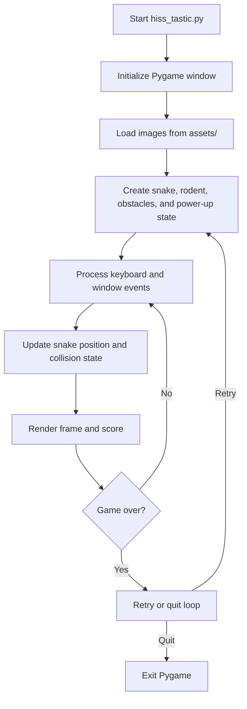

# Architecture

## Status

Hiss-Tastic is a preserved single-file Python/Pygame prototype. The current architecture is intentionally documented before modernization so future work can separate preservation from redesign.

## Components

- `hiss_tastic.py` contains the game loop, input handling, scoring, collision checks, obstacle placement, power-up timing, and rendering.
- `assets/` contains the raster images used by the snake, rodent, obstacle, power-up, and window icon.
- `requirements.txt` declares the runtime dependency on Pygame.

## Runtime Flow

## Data Flow

The game stores state in memory only. It does not persist saves, scores, settings, credentials, or analytics.

## Modernization Boundary

Future modernization may introduce modules, tests, packaging, sound, levels, web builds, or score proof experiments. Those changes should happen after the legacy behavior is documented and should avoid mixing preservation commits with gameplay rewrites.
