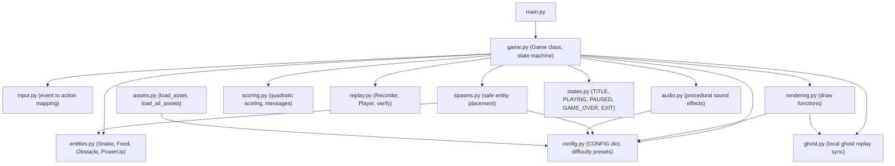
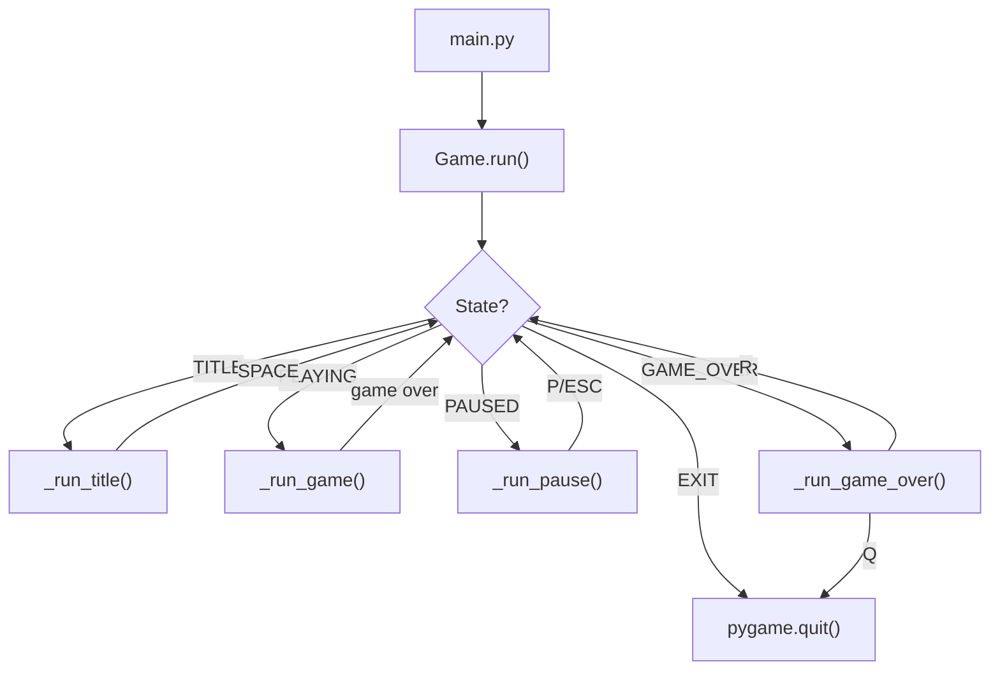
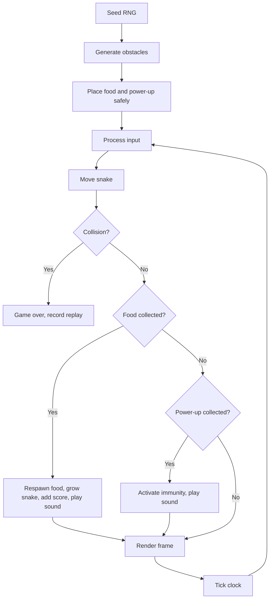
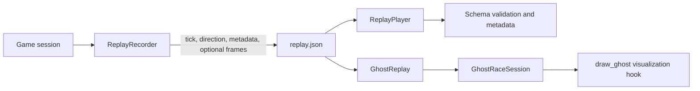

# Architecture

## Status

Hiss-Tastic is a maintained modular Python/Pygame arcade game. The original
single-file prototype has been split into a clean package structure while
preserving all gameplay behavior.

## Module Structure

## Components

| Module | Responsibility |
|--------|---------------|
| `config.py` | Centralized CONFIG dict with all game constants and difficulty presets |
| `entities.py` | Data classes for Snake, Food, Obstacle, PowerUp |
| `assets.py` | Image loading with safe fallbacks (magenta placeholders) |
| `scoring.py` | Quadratic score calculation and legacy insult messages |
| `spawns.py` | Safe grid-aligned entity placement with seeded RNG support |
| `rendering.py` | All Pygame drawing functions (snake, obstacles, UI, overlays) |
| `input.py` | Pygame event processing into InputAction objects |
| `replay.py` | Deterministic replay recording, schema validation, playback, and verification |
| `ghost.py` | Local-only ghost replay loading, sanity validation, tick synchronization, and visualization payloads |
| `audio.py` | Procedural sine-wave sound effects with graceful failure |
| `states.py` | Game state constants |
| `game.py` | Main Game class — state machine orchestrating title, play, pause, game-over |
| `main.py` | Entry point: `python main.py` |

## Runtime Flow

## Game Loop (per session)

## Data Flow

- Game state is stored in-memory within the `Game` class instance.
- Configuration is read from the `CONFIG` dict in `config.py`.
- Assets are loaded once by `assets.py` at game startup.
- Replay files are written to `replays/` as JSON, local storage only.
- Ghost replay data is read from local replay JSON and exposed as renderer-safe, non-scoring payloads.
- No data is sent over the network.

## Replay System

The replay system uses a seeded `random.Random` instance. All random
operations (obstacle generation, food placement, power-up respawn) use
the same seeded RNG. Player inputs are recorded tick-by-tick with their
direction changes. New replay files also include metadata and local frame
snapshots for ghost visualization.

Replay validation checks required fields, replay version compatibility,
seed and score types, sorted tick-indexed input events, valid directions,
frame shape, and local-only metadata.

## Ghost Racing Foundation

Ghost racing is local-only and visualization-only. `GhostReplay` loads a
validated replay file, `GhostRaceSession` synchronizes the ghost by active
game tick, and `draw_ghost()` renders translucent frame snapshots when a
replay contains them.

Ghosts never affect scoring, collisions, spawn placement, difficulty, replay
verification, or game-over behavior. They are display data only.

## Security Boundaries

- The game has no network access, no user accounts, and no file uploads.
- Replay files are local JSON only and validated before playback or ghost use.
- Ghost replay racing adds no networking, telemetry, wallet logic, or multiplayer.
- The only external dependency is `pygame`, installed via pip.

## Modernization History

See [docs/modernization-roadmap.md](docs/modernization-roadmap.md) for the
full modernization plan. Phases 1-5 (Stabilize, Modularize, Replay,
Polish, Packaging) are complete.
