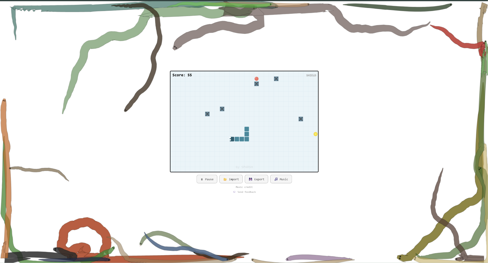
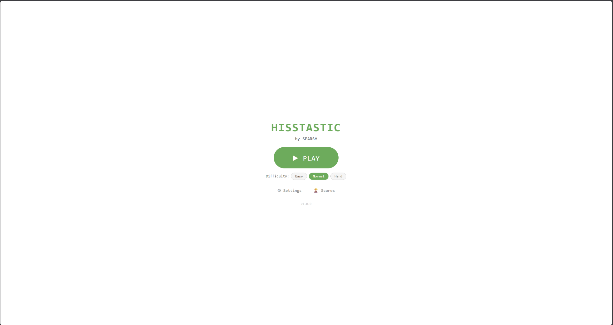
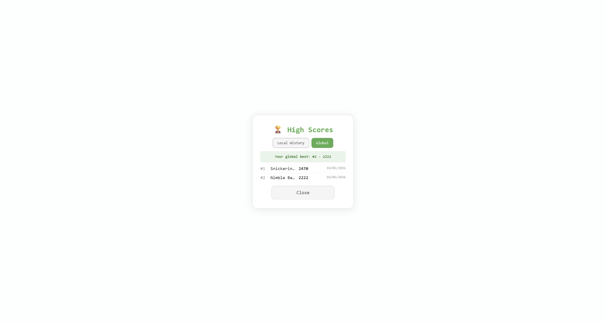
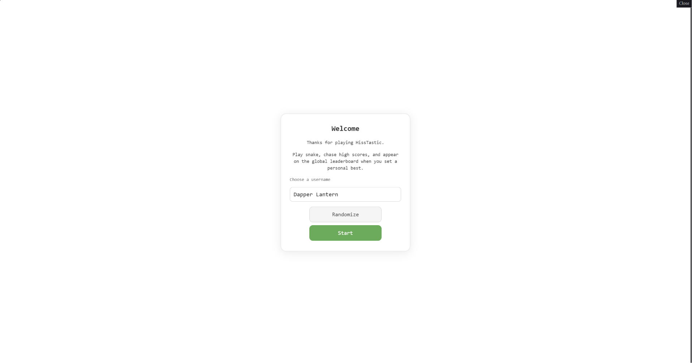

  <picture><source media="(prefers-color-scheme: dark)" srcset="assets/branding/icon.png"></picture>
  <h1>HissTastic</h1>
  
<strong>A retro Snake-inspired arcade game.</strong> Play in your browser or on Android. Local-first, no ads, no accounts.

  

## Gallery

  
  
  

## Why HissTastic

A polished Snake game with modern features but no modern annoyances. No ads, no accounts, no telemetry. Just a snake eating food.

## Features

<table>
<tr>
<td width="50%">

**Power-ups** — 4 types:
- Immunity
- Speed Boost
- Shield
- Score Multiplier

**Difficulty** — Easy / Normal / Hard

**Audio** — Procedural sound effects + looping background music

**Controls** — Keyboard, touch/swipe, on-screen D-pad

**Replay** — Deterministic recording, playback, verification

</td>
<td width="50%">

**Visual Themes** — 4 themes:
- Classic (green)
- Midnight (dark)
- Desert (warm)
- Ocean (teal)

**Pause/Resume** — On-screen pause button

**Haptic Feedback** — Vibration on mobile devices

**Leaderboard** — Global personal-best via Supabase

**Ghost Racing** — Race against your past self

</td>
</tr>
</table>

- **PWA** — Installable, playable offline
- **Android App** — Native APK via Capacitor
- **Local Score History** — Your stats, your device
- **Responsive** — Portrait and landscape modes

## Designed For

Anyone who wants a quick, fun arcade break without signing up for anything.

## Design Philosophy

> "A game that respects your time and privacy."

## Built With

| Layer | Technology |
|-------|-----------|
| Browser game | JavaScript Canvas |
| Python reference | Python + Pygame |
| Android package | Capacitor + Gradle |
| PWA | Service worker + manifest |

## Version Journey

| Version | Date | Milestone |
|---------|------|-----------|
| v1.0.0 | — | Production release |
| v0.5.0 | 2026-05 | PWA + Android |
| v0.3.0 | 2026-04 | Power-ups + themes |
| v0.1.0 | 2026-03 | MVP |

## License

[MIT](LICENSE)

## Open Collection

HissTastic is part of a broader open-source ecosystem. Explore sibling projects:

| Project | Description |
|---------|-------------|
| [OpenPalette](https://github.com/sparshsam/openpalette) | Color palette generator |
| [OpenSend](https://github.com/sparshsam/opensend) | Secure file sharing |
| [OpenSprout](https://github.com/sparshsam/opensprout) | Plant care tracker |
| [OpenTone](https://github.com/sparshsam/opentone) | Music theory tool |

---

*Last updated: June 2026*
